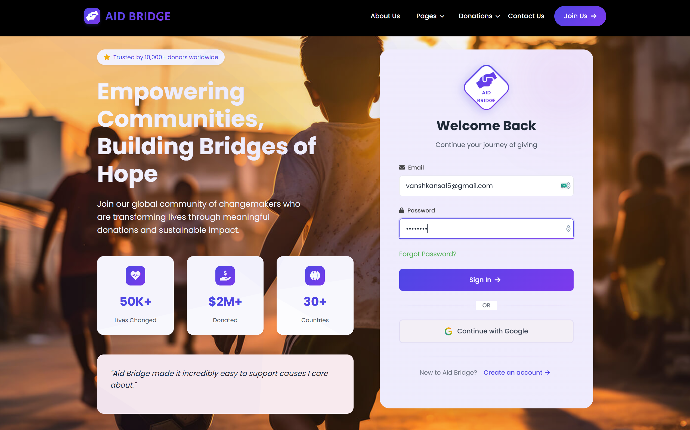
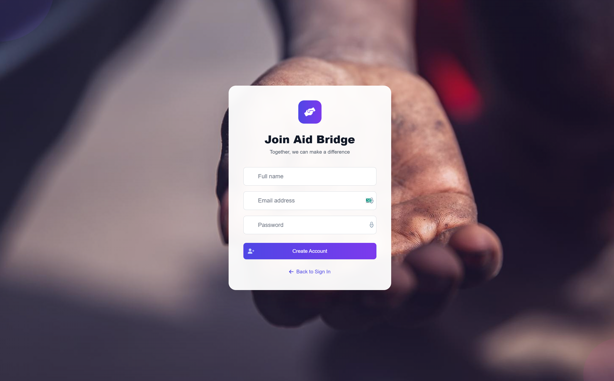
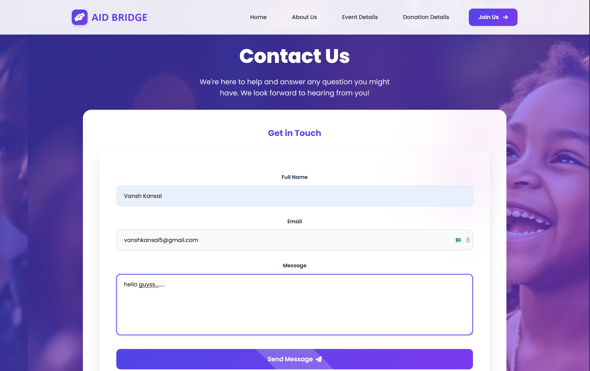
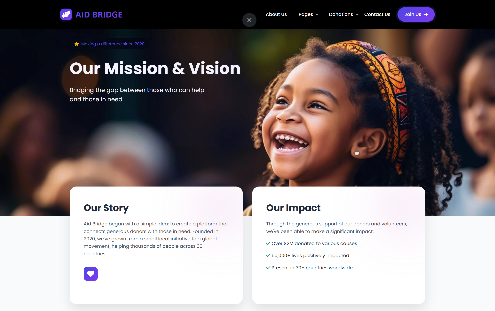
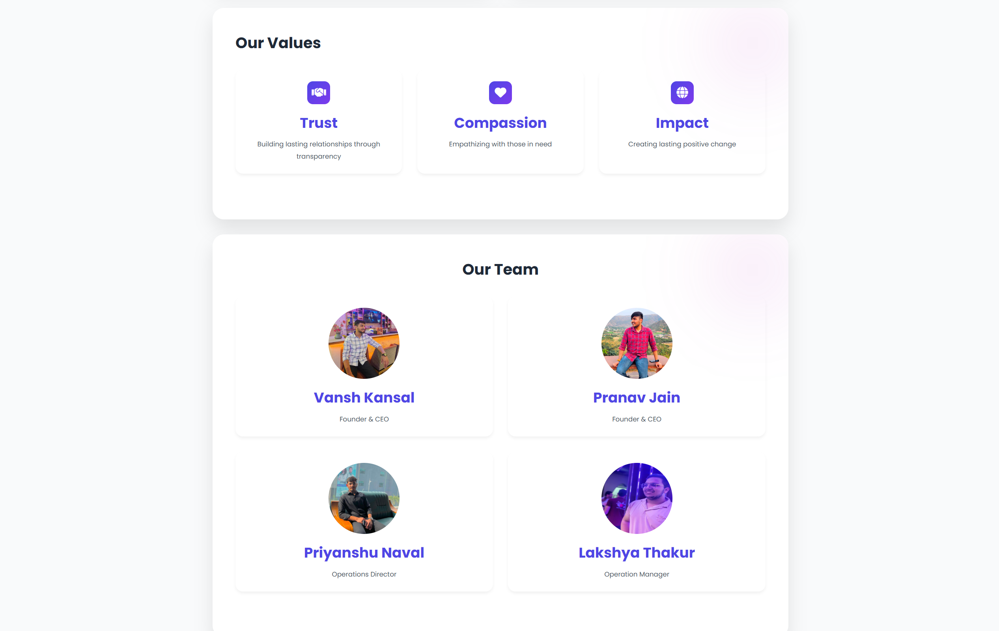
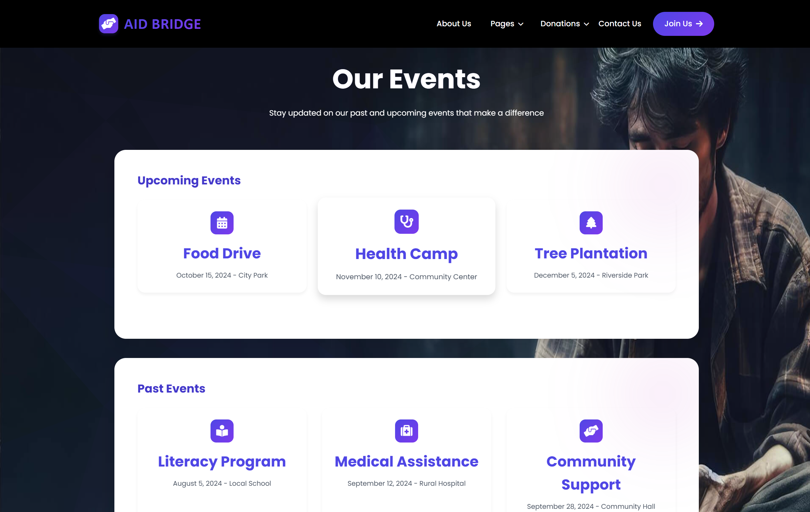
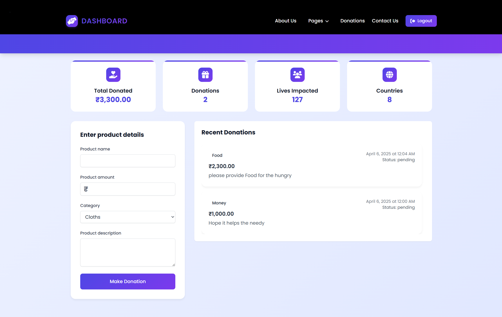
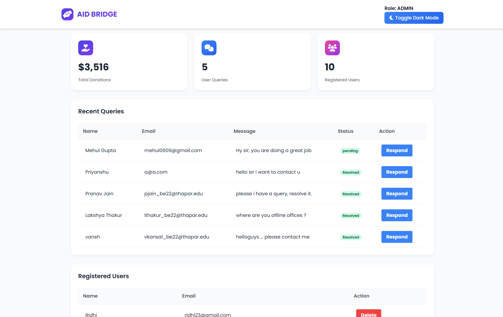
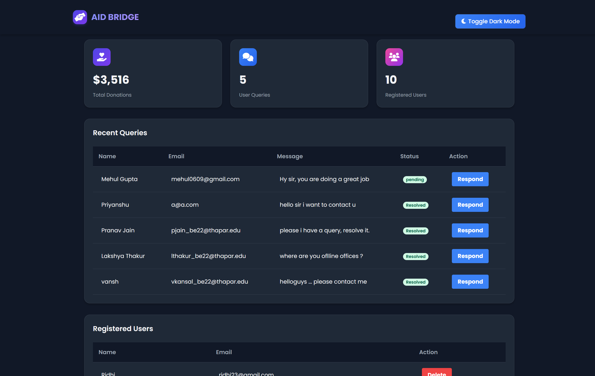

# 🩺 AidBridge - Donation Platform

AidBridge is a web-based platform where donors can contribute items or money, and admins can manage and monitor all activities from a centralized dashboard. It includes secure authentication, role-based access (Donor/Admin), and an intuitive UI for a seamless experience.

---

## 🌐 Live Demo

> [Visit Live Site](https://aid-bridge-frontend.onrender.com)  
> Backend: [https://aid-bridge-backend.onrender.com](https://aid-bridge-backend.onrender.com)

---
## 📸 Screenshots

### 🏠 Home Page (Landing)


### 🔐 Signup Page


### 🙋 Contact Us


### 📃 About Us - Section 1




### 🎉 Our Events


### 🎁 Donation Dashboard (Donor)


### 🛠️ Admin Dashboard - Summary View



---

## 🛠️ Tech Stack

- **Frontend**: HTML, CSS, JavaScript (Vanilla)
- **Backend**: Node.js, Express.js
- **Database**: MongoDB
- **Deployment**: vercel

---

## 🚀 Getting Started

Follow these steps to set up the project locally.

### 1️⃣ Clone the Repository

```bash
git clone https://github.com/your-username/aid-bridge.git
cd aid-bridge
```

### 2️⃣ Setup Backend

```bash
cd backend
npm install
node server.js
```

> ✅ Server will start at: `http://localhost:5000`

Make sure you have MongoDB running or update the `.env` with your MongoDB Atlas connection string.

### 3️⃣ Setup Frontend

Open another terminal:

```bash
cd frontend
```

You can either:
- Open `index.html` directly in a browser
- Or use a simple HTTP server:

```bash
npx serve .
```

---

## 🧑‍💼 Roles & Authentication

### 🔹 Donor

- Can register and log in
- View personal donation history
- Add new donations (money, food, clothing, etc.)
- Contact through the platform

### 🔹 Admin

- Accessible only through `admin.html`
- Can view:
  - All registered users
  - Total donated amount
  - All donation items

---

## 📝 How to Use

### ➕ Register

- Go to `/index.html`
- Sign up using your name, email, and password.
- Choose your role from the backend during seed data creation or registration logic.

### 🔐 Login

- Enter your credentials.
- Redirects based on role:
  - Donor → `dashboard.html`
  - Admin → `admin.html`

### 🎁 Make a Donation

1. Go to the donor dashboard.
2. Fill the donation form with item details.
3. Click "Donate" → Opens a payment modal.
4. Click "Checkout" to simulate payment.

### 📊 View All Donations

- Donors: View only their own donations
- Admin: View all users, donations, and total metrics

---

## ⚙️ Project Structure

```
aid-bridge/
├── backend/
│   ├── server.js
│   └── ...
├── frontend/
│   ├── index.html
│   ├── pages/
│   │   ├── dashboard.html
│   │   └── admin.html
│   ├── public/
│   │   ├── js/
│   │   │   ├── Auth.js
│   │   │   ├── donations.js
│   │   │   └── contact.js
│   └── ...
├── README.md
└── screenshots/
    ├── donor-dashboard.png
    ├── admin-dashboard.png
    ├── donation-modal.png
    ├── login-page.png
    └── contact-form.png
```

---

## ✅ Features

- JWT Authentication
- Role-based Redirection
- Contact Support
- Real-time Donation Updates
- Payment Modal UI
- Admin View for Donors & Items

---

## 🧪 Test Credentials

You can create accounts directly or ask your admin to assign you a role. Example user roles:

| Role   | Email              | Password  |
|--------|--------------------|-----------|
| Donor  | donor@test.com     | 12345678  |
| Admin  | admin@test.com     | 12345678  |

---

## 🙌 Contributing

1. Fork the repo
2. Create a new branch (`git checkout -b feature-x`)
3. Commit your changes (`git commit -m 'Add feature x'`)
4. Push to the branch (`git push origin feature-x`)
5. Open a Pull Request

---

## 📬 Contact

For questions, drop a message via the [Contact Form](https://aid-bridge-frontend.onrender.com/contact.html) or raise an issue.
